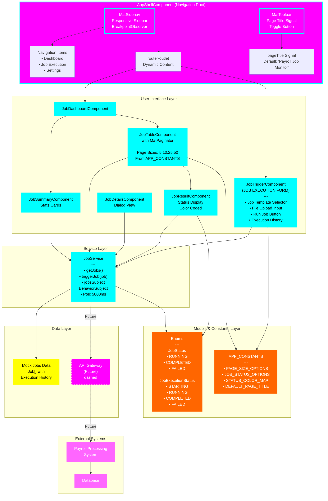

# Payroll Job Monitor - Architecture Diagram

## Architecture Overview

### AppShellComponent (Navigation Root - MAGENTA)
- **Root container** presenting the entire application shell
- **MatSidenav**: Responsive sidebar navigation
  - BreakpointObserver detects mobile (< 768px) vs desktop
  - Auto-closes on mobile, stays open on desktop
  - Navigation items: Dashboard, Job Execution, Settings
- **MatToolbar**: Top navigation bar with:
  - Page title signal (updated based on current route)
  - Hamburger toggle button for sidenav
- **router-outlet**: Placeholder for routed components

### UI Components Layer (CYAN)
- **JobTriggerComponent** (NEW - Job Execution Form):
  - Form to manually trigger job execution
  - Job template selector (dropdown)
  - File upload input for CSV data
  - Execution history display
  - Uses JobExecutionStatus enum for status comparison
  - Emits to JobService when "Run Job" clicked

- **JobDashboardComponent** (CYAN):
  - Main dashboard view after routing to /dashboard
  - Contains JobSummaryComponent and JobTableComponent

- **JobTableComponent** (CYAN - Updated with Pagination):
  - Displays all jobs in MatTable
  - MatPaginator integration (page sizes: 5, 10, 25, 50)
  - Filtering: search + status dropdown
  - Status color-coded using APP_CONSTANTS.STATUS_COLOR_MAP
  - Each row clickable to open JobDetailsComponent

- **JobResultComponent** (CYAN):
  - Shows execution result with dynamic styling
  - Uses JobExecutionStatus enum for color mapping
  - Displays timestamps and messages

### Service Layer (CYAN)
- **JobService**:
  - Central data service
  - Manages jobs via BehaviorSubject
  - Polls data every 5 seconds (RxJS interval)
  - Methods: getJobs(), triggerJob(), getJobDetails()
  - Currently uses mock data; ready for API integration

### Models & Constants Layer (ORANGE - NEW)
- **JobStatus enum**:
  - RUNNING, COMPLETED, FAILED
  - Used for Job model status field
  
- **JobExecutionStatus enum**:
  - STARTING, RUNNING, COMPLETED, FAILED
  - Used for JobExecution model status field
  
- **APP_CONSTANTS object**:
  - PAGE_SIZE_OPTIONS: [5, 10, 25, 50]
  - JOB_STATUS_OPTIONS: status dropdown values
  - STATUS_COLOR_MAP: status → color mapping
  - DEFAULT_PAGE_TITLE: 'Payroll Job Monitor'
  - Single source of truth for configuration

### Data Layer (YELLOW)
- **Mock Jobs Data**: Job[] array with execution history
- **Future API Gateway** (dashed): Placeholder for future backend integration

### External Systems (MAGENTA dashed)
- **Payroll Processing System**: Future external system
- **Database**: Backend data persistence
