# Payroll Job Monitor - Component Class Diagram

```mermaid
classDiagram
    %% Enum Definitions
    class JobStatus {
        <<enumeration>>
        RUNNING
        COMPLETED
        FAILED
    }
    
    class JobExecutionStatus {
        <<enumeration>>
        STARTING
        RUNNING
        COMPLETED
        FAILED
    }
    
    %% Constants
    class APP_CONSTANTS {
        <<object>>
        DEFAULT_PAGE_SIZE: number = 10
        PAGE_SIZE_OPTIONS: number[] = [5, 10, 25, 50]
        DEFAULT_PAGE_TITLE: string
        JOB_STATUS_OPTIONS: StatusOption[]
        STATUS_COLOR_MAP: Map<JobStatus, string>
    }
    
    %% Models
    class Job {
        id: string
        name: string
        status: JobStatus
        createdAt: Date
        updatedAt: Date
        execution: JobExecution
        lastRun?: Date
        nextRun?: Date
    }
    
    class JobExecution {
        id: string
        jobId: string
        status: JobExecutionStatus
        startTime: Date
        endTime?: Date
        result?: string
        errorMessage?: string
        fileName?: string
    }
    
    %% Services
    class JobService {
        -jobsSubject: BehaviorSubject~Job[]~
        +jobs$: Observable~Job[]~
        -pollInterval: number = 5000
        +getJobs(): Observable~Job[]~
        +triggerJob(jobId: string): Observable~JobExecution~
        +getJobDetails(id: string): Observable~Job~
        -startPolling(): void
        -refreshJobs(): void
    }
    
    %% Components
    class AppShellComponent {
        +sidenavOpen: WritableSignal~boolean~
        +isMobile: WritableSignal~boolean~
        +pageTitle: WritableSignal~string~
        -breakpointObserver: BreakpointObserver
        -router: Router
        +ngOnInit(): void
        +toggleSidenav(): void
        -updatePageTitle(route: string): void
        -detectMobileView(): void
    }
    
    class JobDashboardComponent {
        +jobs: WritableSignal~Job[]~
        +selectedJob: WritableSignal~Job | null~
        +jobService: JobService
        +ngOnInit(): void
        -loadJobs(): void
        +onJobSelect(job: Job): void
    }
    
    class JobTriggerComponent {
        +jobForm: FormGroup
        +jobTemplates: WritableSignal~JobTemplate[]~
        +selectedFileName: WritableSignal~string~
        +isExecuting: WritableSignal~boolean~
        +lastExecution: WritableSignal~JobExecution | null~
        +executionHistory: WritableSignal~JobExecution[]~
        -jobService: JobService
        -formBuilder: FormBuilder
        +ngOnInit(): void
        +runJob(): void
        +onFileSelected(event: Event): void
        +clearHistory(): void
        +isPastExecution(): boolean
        -createJobForm(): FormGroup
    }
    
    class JobTableComponent {
        +displayedColumns: string[]
        +@ViewChild(MatPaginator) paginator: MatPaginator
        +dataSource: MatTableDataSource~Job~
        +jobs: WritableSignal~Job[]~
        +selectedStatus: WritableSignal~JobStatus~
        -searchControl: FormControl
        -statusControl: FormControl
        -jobService: JobService
        +ngAfterViewInit(): void
        +onStatusFilterChange(status: JobStatus): void
        +getStatusColor(status: JobStatus): string
        +onTableRowClick(job: Job): void
        -applyFilters(): void
    }
    
    class JobResultComponent {
        +execution: JobExecution
        +getStatusIcon(): string
        +getStatusColor(): string
        +formatDuration(): string
    }
    
    class JobSummaryComponent {
        +totalJobs: WritableSignal~number~
        +runningJobs: WritableSignal~number~
        +completedJobs: WritableSignal~number~
        +failedJobs: WritableSignal~number~
        -jobService: JobService
        +ngOnInit(): void
        -calculateStats(): void
    }
    
    class JobDetailsComponent {
        +job: InputSignal~Job~
        +onClose: Output~void~
        +getDetailedInfo(): DetailInfo
    }
    
    %% Relationships
    AppShellComponent --> JobService : uses
    AppShellComponent --> APP_CONSTANTS : imports
    
    JobDashboardComponent --> JobService : uses
    JobDashboardComponent --> JobTriggerComponent : contains
    JobDashboardComponent --> JobTableComponent : contains
    JobDashboardComponent --> JobSummaryComponent : contains
    
    JobTriggerComponent --> JobService : uses
    JobTriggerComponent --> JobExecutionStatus : uses enum
    JobTriggerComponent --> APP_CONSTANTS : uses constants
    JobTriggerComponent --> Job : creates/triggers
    
    JobTableComponent --> JobService : uses
    JobTableComponent --> JobStatus : uses enum
    JobTableComponent --> APP_CONSTANTS : uses PAGE_SIZE_OPTIONS, STATUS_COLOR_MAP
    JobTableComponent --> Job : displays
    JobTableComponent --> JobDetailsComponent : opens on click
    
    JobResultComponent --> JobExecution : input
    JobResultComponent --> JobExecutionStatus : uses enum
    
    JobSummaryComponent --> JobService : uses
    JobSummaryComponent --> Job : analyzes
    
    JobDetailsComponent --> Job : input
    
    JobService --> Job : manages
    JobService --> JobExecution : creates
    JobService --> JobStatus : reads
    JobService --> JobExecutionStatus : reads

    %% Styling
    style JobStatus fill:#ff6600
    style JobExecutionStatus fill:#ff6600
    style APP_CONSTANTS fill:#ff6600
    
    style Job fill:#ffff00
    style JobExecution fill:#ffff00
    
    style JobService fill:#00ffff
    
    style AppShellComponent fill:#ff00ff,color:#fff
    style JobDashboardComponent fill:#00ffff
    style JobTriggerComponent fill:#00ffff
    style JobTableComponent fill:#00ffff
    style JobResultComponent fill:#00ffff
    style JobSummaryComponent fill:#00ffff
    style JobDetailsComponent fill:#00ffff
```



## Component Class Details

### AppShellComponent (Navigation Root - MAGENTA)
**Purpose**: Root component managing application shell with navigation

**Signals**:
- `sidenavOpen`: Controls sidenav expand/collapse state
- `isMobile`: Tracks if current viewport is mobile (< 768px)
- `pageTitle`: Dynamic page title based on current route

**Key Methods**:
- `ngOnInit()`: Initialize router event subscription
  - Subscribes to `Router.events` with `filter(event instanceof NavigationEnd)`
  - Updates `pageTitle` based on route URL
  - Sets `pageTitle = 'Job Execution Form'` when URL includes `/trigger`
  - Sets `pageTitle = 'Dashboard'` when URL includes `/dashboard`
- `toggleSidenav()`: Toggle sidebar open/close
- `detectMobileView()`: Uses BreakpointObserver for responsive design

**Dependencies**: Router, BreakpointObserver, Angular Material modules

---

### JobTriggerComponent (Job Execution Form - CYAN)
**Purpose**: Allow users to manually trigger job execution with file upload

**Signals**:
- `jobTemplates`: Available job templates for selection
- `selectedFileName`: Currently selected file name
- `isExecuting`: Indicates if job is currently running
- `lastExecution`: Most recent execution result
- `executionHistory`: Array of past job executions

**Form Controls**:
- `jobTemplate`: Required, Validators.required
- `fileUpload`: Optional file selection
- `executionNote`: Optional note about execution

**Key Methods**:
- `runJob()`:
  1. Validates form using FormBuilder validators
  2. Creates JobExecution object with `status = JobExecutionStatus.STARTING`
  3. Calls `JobService.triggerJob(execution)`
  4. Handles response updating signals
  5. **Type-Safe**: Uses `JobExecutionStatus` enum for status comparison
  6. On completion: `if (execution.status === JobExecutionStatus.COMPLETED || execution.status === JobExecutionStatus.FAILED)`
- `onFileSelected(event)`: Updates `selectedFileName` signal
- `clearHistory()`: Clears execution history
- `isPastExecution()`: Checks if execution is complete (using enum comparison)

**Dependencies**: JobService, FormBuilder, APP_CONSTANTS, JobExecutionStatus enum

---

### JobTableComponent (Data Grid with Pagination - CYAN)
**Purpose**: Display jobs in paginated table with filtering and search

**ViewChild Reference**:
- `@ViewChild(MatPaginator) paginator`: Reference to MatPaginator for programmatic control

**Form Controls**:
- `searchControl`: Text search input
- `statusControl`: Status filter dropdown

**Configuration (from APP_CONSTANTS)**:
- `PAGE_SIZE_OPTIONS`: [5, 10, 25, 50] items per page
- `DEFAULT_PAGE_SIZE`: 10 items default
- `JOB_STATUS_OPTIONS`: Dropdown items with labels and colors
- `STATUS_COLOR_MAP`: Maps JobStatus enum to Material colors

**Key Methods**:
- `ngAfterViewInit()`:
  1. Connects paginator to dataSource
  2. Initializes reactive filter stream with RxJS operators
  3. Combines search + status controls with `combineLatest()`
- `onStatusFilterChange(status: JobStatus)`: **Type-Safe** enum comparison
- `getStatusColor(status: JobStatus)`: Returns color from `APP_CONSTANTS.STATUS_COLOR_MAP`
- `applyFilters()`: Applies combined search + filter logic

**Reactive Pattern**:
```typescript
combineLatest([
  this.searchControl.valueChanges.pipe(startWith('')),
  this.statusControl.valueChanges.pipe(startWith(JobStatus.RUNNING))
]).pipe(
  map(([search, status]) => ({ search, status })),
  debounceTime(300),
  distinctUntilChanged()
).subscribe(filters => {
  this.dataSource.filter = JSON.stringify(filters);
});
```

---

### JobResultComponent (Execution Result Display - CYAN)
**Purpose**: Display job execution result with status styling

**Input**:
- `@input() execution: JobExecution`

**Key Methods**:
- `getStatusIcon()`: Returns icon based on `JobExecutionStatus` enum
- `getStatusColor()`: **Type-Safe** switch on `JobExecutionStatus` enum
  ```typescript
  case JobExecutionStatus.COMPLETED: return '#4caf50' (green)
  case JobExecutionStatus.RUNNING: return '#ff9800' (orange)
  case JobExecutionStatus.FAILED: return '#f44336' (red)
  ```
- `formatDuration()`: Calculates execution time

---

### JobService (Central Service - CYAN)
**Purpose**: Manage job data, polling, and triggering

**BehaviorSubject Pattern**:
- `private jobsSubject: BehaviorSubject<Job[]>` - Internal state
- `public jobs$: Observable<Job[]>` - Public observable stream

**Key Methods**:
- `getJobs()`: Returns `jobs$` observable with auto-polling every 5000ms
- `triggerJob(jobId: string)`: Creates new JobExecution and adds to jobs
- `getJobDetails(id: string)`: Returns single job details
- `startPolling()`: Uses RxJS `interval()` + `switchMap()` for continuous polling

**Polling Logic**:
```typescript
this.pollInterval$ = interval(5000).pipe(
  switchMap(() => /* fetch jobs operation */),
  tap(jobs => this.jobsSubject.next(jobs))
)
```

---

### Enums (Models Layer - ORANGE)

**JobStatus enum**:
- `RUNNING = 'RUNNING'` - Job currently executing
- `COMPLETED = 'COMPLETED'` - Job finished successfully
- `FAILED = 'FAILED'` - Job failed execution

**JobExecutionStatus enum**:
- `STARTING = 'STARTING'` - Execution initialization phase
- `RUNNING = 'RUNNING'` - Execution in progress
- `COMPLETED = 'COMPLETED'` - Execution finished successfully
- `FAILED = 'FAILED'` - Execution failed

**Benefits**:
✅ Type-safe comparisons (compiler catches typos)
✅ IDE autocompletion
✅ No string literals scattered in code
✅ Single source of truth

---

### APP_CONSTANTS Object (Models Layer - ORANGE)

**Purpose**: Centralized configuration and lookup tables

**Properties**:
- `DEFAULT_PAGE_SIZE: 10` - Paginator default
- `PAGE_SIZE_OPTIONS: [5, 10, 25, 50]` - Available page sizes
- `DEFAULT_PAGE_TITLE: 'Payroll Job Monitor'` - Initial page title
- `JOB_STATUS_OPTIONS`: Array of `{value: JobStatus, label: string, color: string}`
- `STATUS_COLOR_MAP`: Object mapping `JobStatus → Material color hex code`

**Usage Pattern**:
```typescript
// In component
pageSizeOptions = APP_CONSTANTS.PAGE_SIZE_OPTIONS;
statusOptions = APP_CONSTANTS.JOB_STATUS_OPTIONS;
color = APP_CONSTANTS.STATUS_COLOR_MAP[jobStatus];
```

**Benefits**:
✅ Single location for all configuration
✅ Easy to update values globally
✅ Consistent styling across components
✅ Testable constants

